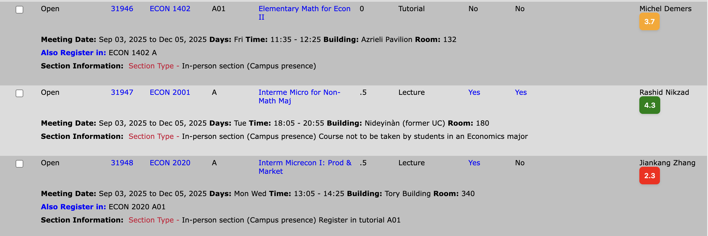
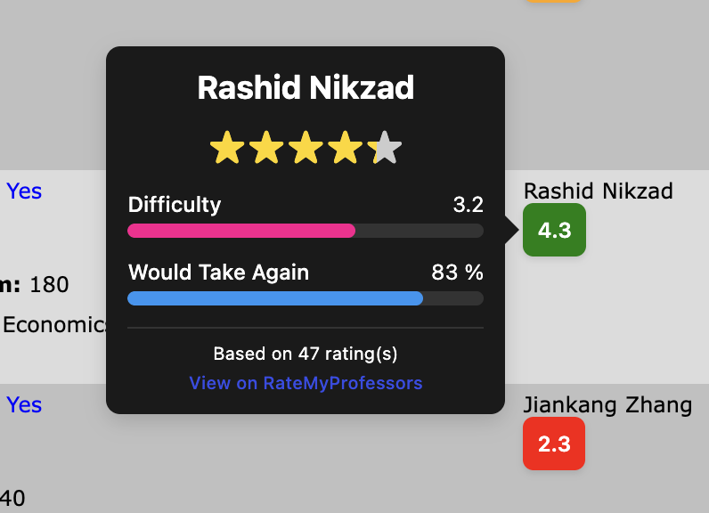
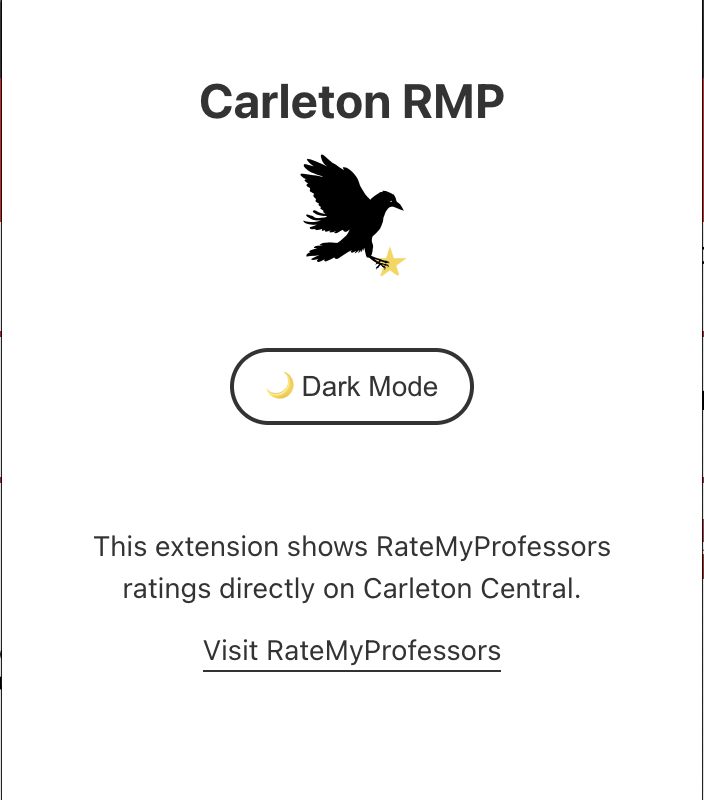

# Carleton RMP

<p align="center">
  
</p>

A Chrome extension that integrates Rate My Professors data directly into Carleton Central's course registration page. This extension provides quick access to professor ratings and reviews while browsing courses.

## Screenshots

<p align="center">
  
  <br>
  <em>Rating badges displayed next to professor names</em>
</p>

<p align="center">
  
  <br>
  <em>Hover tooltip showing detailed professor information</em>
</p>

<p align="center">
  
  <br>
  <em>Popup that appears when you click the extension icon</em>
</p>


## Features

- Displays professor ratings and reviews from Rate My Professors
- Caches professor data for improved performance (7-day cache)
- Seamless integration with Carleton's course registration system
- Automatic professor name matching with fuzzy search
- Dark/Light mode support
- Hover tooltips with detailed professor information
- Star rating visualization

## Installation

### For Users

1. Download the zip
2. Extract the ZIP file
3. Open Chrome and navigate to `chrome://extensions/`
4. Enable "Developer mode" in the top right corner
5. Click "Load unpacked" and select the extracted folder

### For Developers

1. Clone this repository:
```bash
git clone https://github.com/yourusername/carleton-rmp.git
cd carleton-rmp
```

2. Install dependencies:
```bash
npm install
```

3. Build the extension:
```bash
npm run build
```

4. Load the `dist` folder in Chrome as described above

## Usage

1. **Navigate** to the Carleton Central course selection page
2. **Search** for courses as you normally would
3. **View ratings** - Professor names will show color-coded rating badges:
   - 🟢 Green (4.0-5.0): Excellent ratings
   - 🟡 Yellow (3.5-3.9): Good ratings  
   - 🟠 Orange (2.5-3.4): Average ratings
   - 🔴 Red (1.0-2.4): Poor ratings
   - ⚪ Gray (N/A): No ratings available
4. **Hover** over rating badges to see detailed information including:
   - Overall rating and star visualization
   - Difficulty level
   - "Would take again" percentage
   - Number of reviews
   - Direct link to RateMyProfessors page

## Permissions

This extension requires the following permissions:

- **`storage`**: To cache professor ratings locally for improved performance
- **`tabs`**: To reload tabs when theme preferences change
- **`host_permissions` for ratemyprofessors.com**: To fetch professor rating data

**Privacy**: This extension does not collect, store, or transmit any personal data. Professor ratings are cached locally on your device only.

## Development

This project is built using:
- **TypeScript** - Type-safe JavaScript
- **React** - UI components for the popup
- **Vite** - Build tool with HMR
- **Chrome Extension APIs** - Browser extension functionality
- **@mtucourses/rate-my-professors** - API wrapper for RateMyProfessors


### Project Structure

```
carleton-rmp/
├── src/
│   ├── background/     # Background service worker
│   │   └── background.ts
│   ├── content/        # Content scripts
│   │   ├── content.ts
│   │   ├── styles.css
│   │   └── utils.ts
│   ├── App.tsx         # Popup UI component
│   ├── App.css         # Popup styles
│   └── main.tsx        # React entry point
├── assets/             # Extension icons
├── manifest.json       # Extension configuration
├── index.html          # Popup HTML
├── package.json        # Dependencies and scripts
├── tsconfig.json       # TypeScript configuration
├── vite.config.ts      # Vite build configuration
└── README.md
```

## Known Issues

- Professor name matching may occasionally fail for professors with complex names or nicknames

## Privacy Policy

This extension:
- ✅ Does NOT collect personal information
- ✅ Does NOT track browsing activity
- ✅ Only accesses Carleton Central and RateMyProfessors when actively used
- ✅ Stores rating data locally on your device only
- ✅ Does NOT transmit data to third parties

Rating data is fetched directly from RateMyProfessors' public API and cached locally for performance.

## License

This project is licensed under the MIT License - see the [LICENSE](LICENSE) file for details.

## Acknowledgments

- [Rate My Professors](https://www.ratemyprofessors.com/) for providing the rating data
- [@mtucourses/rate-my-professors](https://github.com/Michigan-Tech-Courses/rate-my-professors) for the API wrapper
- Carleton University for their course registration system 
