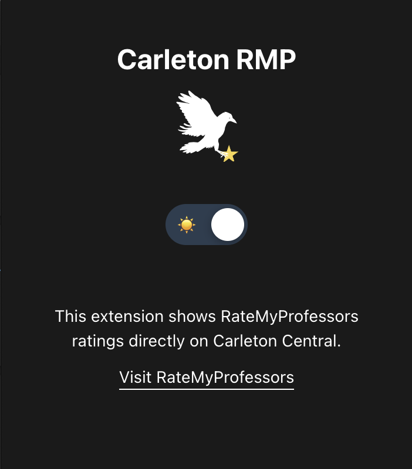

<h2 align="center">Carleton RMP</h2>

<p align="center">
  
</p>

A Chrome extension that integrates Rate My Professors data directly into Carleton Central's course registration page. This extension provides quick access to professor ratings and reviews while browsing courses.

## Screenshots

<p align="center">
  
  <br>
  <em>Rating badges displayed next to professor names</em>
</p>

<p align="center">
  
  <br>
  <em>Hover tooltip showing detailed professor information</em>
</p>

<p align="center">
  
  <br>
  <em>Popup that appears when you click the extension icon</em>
</p>


## Features

- Displays professor ratings and reviews from Rate My Professors
- Caches professor data for improved performance (7-day cache)
- Seamless integration with Carleton's course registration system
- Automatic professor name matching with fuzzy search
- Dark/Light mode support
- Hover tooltips with detailed professor information
- Star rating visualization

## Installation

### For Users

Download from Chrome Store: https://chromewebstore.google.com/detail/carleton-rmp/pbefhmhjgccbpifkphfhlbheeeifkplh

### For Developers

1. Clone this repository:
```bash
git clone https://github.com/yourusername/carleton-rmp.git
cd carleton-rmp
```

2. Install dependencies:
```bash
npm install
```

3. Build the extension:
```bash
npm run build
```

4. Open Chrome and navigate to `chrome://extensions/`

5. Enable "Developer mode" in the top right corner

6. Click "Load unpacked" and select the `dist` folder

## Usage

1. **Navigate** to the Carleton Central course selection page
2. **Search** for courses as you normally would
3. **View ratings** - Professor names will show color-coded rating badges:
   - 🟢 Green (4.0-5.0): Excellent ratings
   - 🟡 Yellow (3.5-3.9): Good ratings  
   - 🟠 Orange (2.5-3.4): Average ratings
   - 🔴 Red (1.0-2.4): Poor ratings
   - ⚪ Gray (N/A): No ratings available
4. **Hover** over rating badges to see detailed information including:
   - Overall rating and star visualization
   - Difficulty level
   - "Would take again" percentage
   - Number of reviews
   - Direct link to RateMyProfessors page
